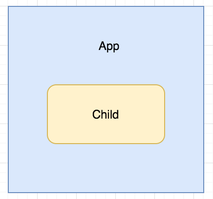

# demo3 源码结构

参照模式：


参照官网上给出的图，使用webpack实现源码结构的打包demo

App结构如下图：



下面是项目运行时打印的日志：

**服务端**
```
>>App>> beforeCreate 被调用
>>App>> created 被调用
>>Child>> beforeCreate 被调用
>>Child>> created 被调用
```

**浏览器**
```
>>App>> beforeCreate 被调用
>>App>> created 被调用
>>App>> beforeMount 被调用
>>Child>> beforeCreate 被调用
>>Child>> created 被调用
>>Child>> beforeMount 被调用
>>Child>> mounted 被调用
>>App>> mounted 被调用
```

由上可以看出，编写的业务组件代码在服务端跑了一遍（只执行了组件的`beforeCreate` 和 `created`钩子函数），然后浏览器又会跑了一遍。

浏览器能立即显示服务端返回的结果，当浏览器端运行完毕后会和服务端返回结果进行对比混合。

此时可能疑惑，反正浏览器这边会执行，为什么服务器端要先跑一遍？

根据项目经验就我的理解，现在流行的前端框架，最后打包的都是js文件，浏览器运行js再吐出html再将整个页面渲染完毕，这个过程确实会花费一段时间。尤其在性能比较差的移动端，一个移动端很简单的页面，用单页面框架来做，它的首屏加载时间在实战中很不理想。如果在服务端先跑出一个快照，再加以利用缓存，能大大提升首屏加载的体验。除此之外还能解决SEO的问题。

所以服务器端先渲染，主要就是解决单页面应用首屏加载时间和单页面应用SEO的问题。
